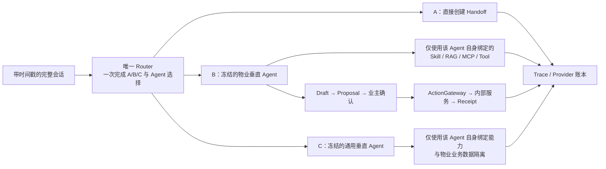

# YIAI 物业 AI 平台｜求职 Demo 最终验收卡

> 封版日期：2026-08-11  
> 结论：四项目标按求职 Demo 口径全部通过，停止功能施工  
> 最终 Git 标签：`interview-demo-final-20260811`  
> 性质：个人 AI 产品经理求职演示，不代表生产系统验收

配套演示指南：[YIAI 物业 AI 平台｜最终面试演示指南](./S10-B-DEMO-SURFACE-GUIDE.md)

## 1. 产品定位

YIAI 物业不是一个只会聊天的页面，而是一套可操作、可解释、可追溯的 AI 物业能力平台。它重点证明四件事：

1. AI 能在同一会话里正确区分人工协同、物业业务和通用问答；
2. 平台可以通过 RuntimeRelease 控制 Agent 及其能力绑定，并让新会话按发布版本生效；
3. 低质量结果能够进入 Badcase / Golden Set 人工治理闭环；
4. 每个真实 Provider 请求都能按模型、节点、Token 和成本解释，选定日期可与供应商后台聚合核对；当前仅冻结基准日完成了精确一致验证。

## 2. 冻结坐标

| 对象 | 最终坐标 | 说明 |
|---|---|---|
| 功能代码基线 | `072eea41e091d2dd9f7dd930b900a200f0911715` | 已推送 GitHub `main`，用户已完成最终手点 |
| NAS 功能代码 | `836ee56cdcb1c8329fc35e11811f17b020d21407` | 与 Windows 功能代码树一致 |
| 功能代码树 | `ca638c7` | Windows / NAS 内容一致；提交历史因 NAS 使用受控落地而不同 |
| RuntimeRelease | `rr_0035_434b97c5 / v35 / published` | 继续作为线上新会话的当前配置版本 |
| Git 封版标签 | `interview-demo-final-20260811` | 指向仅新增最终文档、未改功能代码的封版提交 |

Git 代码版本、RuntimeRelease 配置版本和会话 Snapshot 是三个不同对象：Git 管代码备份，RuntimeRelease 管平台配置，新会话在首次运行时固定 Snapshot。

## 3. 最终运行合同

- Router 只看当前 Release 中 Agent 的稳定 ID、名称、描述和结构化范围，不查看其能力绑定；
- B/C Agent 选定后冻结，不回溯、不换 Agent、不调用第二个 Agent；
- Skill 按需使用；RAG 只把实际采用的证据列为引用；MCP 结果不冒充参考资料；
- MCP 保持只读，写入由物业 Agent 提出 Proposal，业主确认后才进入 ActionGateway；
- Trace 只记录真实执行，不参与路由、回答或答案覆盖；
- 每个物理 Provider 请求独立落账。

## 4. 四目标最终结论

| 目标 | 最终状态 | 用户可见证明 |
|---|---|---|
| ① AI 业务主链 | **PASS** | 儿童托管正确进入 B 类儿童教育 Agent；Skill 可真实命中；装修问答使用真实 RAG 引用；工单查询使用只读 MCP；报修先生成 Proposal，确认后才产生 Receipt 和正式工单；A/C 与物业边界可从 Trace 核验 |
| ② 能力热绑定 | **PASS** | 在原管理界面绑定/解绑系统现有能力，查看 Draft/Diff，发布 RuntimeRelease；旧会话保持原 Snapshot，新会话采用新版本。用户已用 Skill 完成代表性热绑定验收，同一发布机制不再对 RAG/MCP/Tool 做全排列烧测 |
| ③ 质量闭环 | **PASS** | 自动疑似 Badcase 与人工新增均由人工处理；Darwin · Pro 只生成建议，不自动改状态；重复生成已受控；Golden Set 由人工创建、运行真实链路并最终人工裁决 |
| ④ 成本治理 | **PASS** | 日期统计按 Flash/Pro 展示调用次数、Hit、Miss、Output、Total；Trace 展示每次物理请求所在节点、模型、Thinking、Token、成本和耗时；页面解释减少调用、减少装载和质量边界 |

### ④-A 冻结对账基准

北京时间 2026-08-01：

- Provider 请求：15 次；
- Cache Hit：4,096；Cache Miss：12,373；
- Output：6,714，其中 Reasoning：5,009；
- Total：23,183；
- 平台冻结价格快照成本：¥0.02588292；
- 与 DeepSeek 后台精确一致。

统计关系为 `Input = Hit + Miss`、`Total = Input + Output`。Reasoning 已包含在 Output 中，不能再次加入 Total。

## 5. 已接受的 Demo 限制

- 工单确认成功后重新加载历史对话，旧 Proposal 卡仍可能再次显示；幂等保护会复用原结果，不会重复创建正式工单。该展示瑕疵已由产品负责人接受，不影响面试主路径。
- “相邻上下文（未单独评分）”表示它是命中分片的邻接上下文，不代表内容不相关，也不伪造继承分数。
- 平台展示的是 Provider 返回 Usage 与平台价格快照；除已冻结人工对账日外，不宣称自动等同供应商最终账单。
- 本项目不承诺生产级账号安全、并发容量、高可用、合规、SLA 或任意第三方插件即插即用。

## 6. 封版规则

从本标签开始，除以下情况外不再施工：

1. 简历中的线上 URL 无法访问；
2. 面试必演的核心路径无法完成；
3. 展示内容出现明显虚假事实或错误写入。

其他优化、历史兼容和生产工程化问题统一作为面试中的“后续生产化路线”，不再改动当前 Demo。
